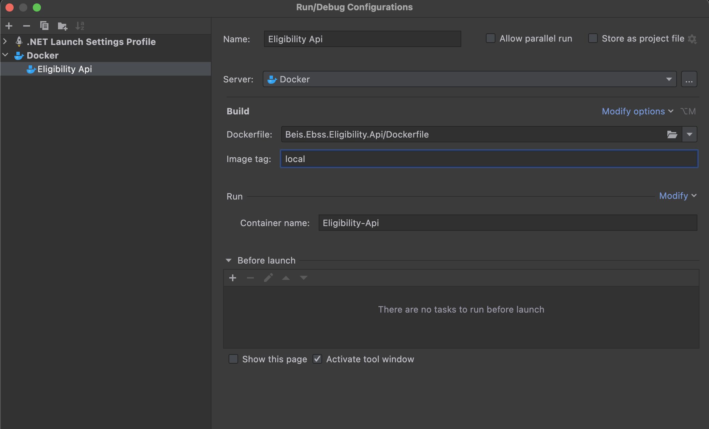

# Introduction 
This api is responsible for handling of documents, for example, storage, virus checking, status...
# Getting Started
1. Clone this repo
2. To get up and running you'll need a few things installed on your machine.
   1. [Dotnet 6](https://dotnet.microsoft.com/en-us/download/dotnet/6.0)
   2. [ASP.NET Core](https://github.com/aspnet/Home)
   3. [Docker](https://www.docker.com/products/docker-desktop/)
   4. List anything else here
   
3. You can develop this project using a number of IDE's. Here a few options:
   1. [Visual Studio](https://visualstudio.microsoft.com/vs/)
   2. [Visual Studio Code](https://code.visualstudio.com/download)
   3. [Rider](https://www.jetbrains.com/rider/)

# Build and Test
1. Build the whole solution and if you run into problems, make sure that the relevent packages have been restored.
2. You can run the app with the default configuration and it should launch a swagger page where you can execute the api.
   If you want to run the api using docker, you'll need to create a new configuration:

## Create docker launch configuration (Images should render locally)
Find the Configuration dropdown menu towards the top right and hit edit configuration.

Then hit the plus sign to add a new configuration.

 
Choose Dockerfile

   
File in the name and image tag (must be lowercase) and make sure the dockerfile is pointing to the correct file (root of solution)

Hit "Modify" to bind a local port to a docker port

-

-

-

In this instance port 8006 on your computer is bound to port 80 in docker.

If you launch the app using this new configuration you should be able to view the app at:
http://localhost:8006/swagger/index.html